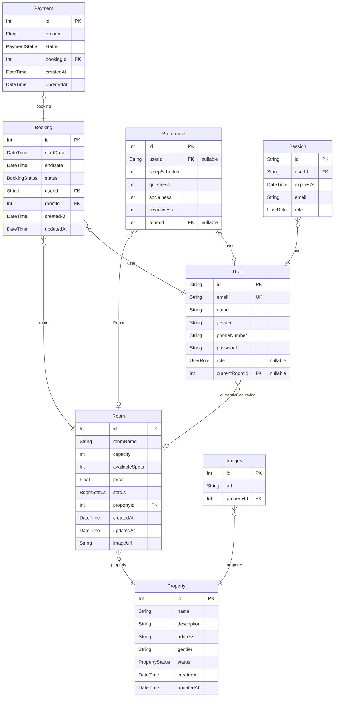

# Shopping Mall
> Generated by [`prisma-markdown`](https://github.com/samchon/prisma-markdown)

- [default](#default)

## default

### `Room`

**Properties**
  - `id`: 
  - `roomName`: 
  - `capacity`: 
  - `availableSpots`: 
  - `price`: 
  - `status`: 
  - `propertyId`: 
  - `createdAt`: 
  - `updatedAt`: 
  - `imageUrl`: 

### `User`

**Properties**
  - `id`: 
  - `email`: 
  - `name`: 
  - `gender`: 
  - `phoneNumber`: 
  - `password`: 
  - `role`: 
  - `currentRoomId`: 

### `Booking`

**Properties**
  - `id`: 
  - `startDate`: 
  - `endDate`: 
  - `status`: 
  - `userId`: 
  - `roomId`: 
  - `createdAt`: 
  - `updatedAt`: 

### `Preference`

**Properties**
  - `id`: 
  - `userId`: 
  - `sleepSchedule`: 
  - `quietness`: 
  - `socialness`: 
  - `cleanliness`: 
  - `roomId`: 

### `Session`

**Properties**
  - `id`: 
  - `userId`: 
  - `expiresAt`: 
  - `email`: 
  - `role`: 

### `Property`

**Properties**
  - `id`: 
  - `name`: 
  - `description`: 
  - `address`: 
  - `gender`: 
  - `status`: 
  - `createdAt`: 
  - `updatedAt`: 

### `Payment`

**Properties**
  - `id`: 
  - `amount`: 
  - `status`: 
  - `bookingId`: 
  - `createdAt`: 
  - `updatedAt`: 

### `Images`

**Properties**
  - `id`: 
  - `url`: 
  - `propertyId`: 